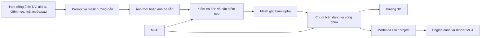

# Mục tiêu đã chốt

Người dùng muốn sửa prompt chuẩn bị ảnh và logic mesh hoa, cỏ 360°, loa kèn; bổ sung uốn, xoắn, lồi/lõm, kéo mềm để tạo hình đa dạng ngay trong Xưởng Lắp Ráp 3D. Đã xác nhận **hai mẫu riêng**: loa kèn sáu cánh loe và rum/calla một cánh cuộn thành phễu. Đây là kế hoạch, chưa triển khai code.

“Độ dẻo” được hiểu trước mắt là kéo mềm có bán kính ảnh hưởng/falloff và ghim điểm, cùng chỉnh bằng khung điều khiển. Biến dạng tĩnh và chuyển động gió hiện có vẫn được hỗ trợ. Mô phỏng vật lý đàn hồi/va chạm thời gian thực cần yêu cầu và thiết kế riêng; không ngầm hứa toàn bộ Blender.

## Kết quả khảo sát mới nhất

Baseline khảo sát: commit `a8e9c3b` trên `Edit_Asset_3D`. Repository đã có thay đổi sau bản `bd9f3da`: alpha rules, symmetry, silhouette preview, hoa kèn, cỏ radial, bendLateral/curl/arcAngle/taperRatio. Phải đọc lại diff trước khi code; không ghi đè tài nguyên và model người dùng đang làm.

1. Prompt đã tách ảnh phẳng/ảnh kín/alpha, tỷ lệ và ảnh dùng lại. Không cần làm lại từ đầu. Nhưng chưa có hợp đồng điểm neo, vùng tiếp giáp và mask hình dáng đủ rõ để bảo đảm ráp đúng sau biến dạng.
2. `imageMeshRecipe.ts` xuất width/height, normal/up, bendX/Y, nhưng chưa phản ánh đầy đủ bendRegion, bendLateral, arcAngle/taperRatio, silhouette và điểm ghim của mesh mới. AI thiếu thông tin cấu trúc.
3. `resolveImageTemplate` đổi kích thước/tâm bằng scale không đều nhưng giữ nguyên normal/up. Các biến thể mới của hoa kèn/cỏ có scale không đều; cần tái sinh từ tham số cấu trúc để giữ gốc và tỷ lệ ảnh, thay vì kéo giãn tùy tiện.
4. Prompt `leaf` chừa alpha 4%; lá chậu đặt tâm y=230, h=240 và đất y=108. Nếu làm đúng padding, đáy pixel lá ở khoảng y=119.6, cao hơn đất 11.6 đơn vị trước khi xét biến dạng. Sửa bằng điểm neo thật.
5. Bụi cỏ radial hiện ghép các polygon dáng cong và cộng uốn; khi có ảnh, alpha của ảnh thay polygon preview. Một ảnh lá thẳng có thể cho hình khác preview nếu biến thiên hình dáng chỉ nằm trong polygon. Dáng cong phải là biến dạng hình học của cùng mesh gốc.
6. `insertModel3D.ts` hiện tạo ImageLayer/SolidLayer từ kích thước và transform, chưa chuyển toàn bộ mesh deformation. **Đồng bộ xưởng → cảnh → MP4 là tiêu chí chặn phát hành**, không để dành sau.
7. `alphaMeshBuilder.ts` hiện trả X/Z cho bend, Y vẫn tuyến tính; chỉnh cell theo `cellBendAngle` là dịch Z đồng loạt. Key hàn vertex chứa extraZ có thể tách biên vùng chọn. Cần trường biến dạng XYZ liên tục theo weight, không tăng thêm nhiều preset trên cơ chế dịch cell này.

## Kiến trúc đề xuất

Lõi hình học dùng chung đặt tại `engine/imageMesh/`; kiểu JSON serializable đặt ở `src/shared/`. UI chỉ quản lý công cụ/gesture và gọi hàm thuần. Mesh lưu bản gốc, UV và cấu hình biến dạng; không tích lũy sai số bằng cách bẻ tiếp lên vertex đã bẻ mỗi frame. Compatibility adapter giữ nguyên cách đọc model cũ.

### Bộ công cụ người dùng sẽ có

| Nhóm | Công cụ | Ứng dụng |
|---|---|---|
| Uốn theo trục | Bend, Twist, Taper, Stretch/Squash | Cong cánh, xoắn lá, thắt cổ/loe miệng, dài/ngắn |
| Uốn theo đường | 3–5 điểm điều khiển và tay nắm tiếp tuyến | Lá rủ, cỏ chữ S, cánh loa kèn cuộn ngược |
| Điêu khắc mềm | Inflate/Deflate, Grab, Smooth, Crease | Tạo lồi/lõm cục bộ, kéo dẻo, làm mượt, gân/nếp |
| Khung điều khiển | Lattice mặc định 4×4, hỗ trợ tăng vừa phải | Bóp/xòe/cụp cả phiến mà không chọn từng đỉnh |
| Bảo vệ hình dáng | Pin/mask gốc, falloff, giới hạn vùng | Uốn ngọn trong khi cuống vẫn gắn đúng |
| Quản lý biến dạng | Bật/tắt, sắp thứ tự, reset từng bước, trước/sau | Thử nhiều hình dáng và quay về hình gốc |

Các tên Bend/Twist/Taper/Stretch tương ứng nhóm Simple Deform của Blender; Lattice biến dạng qua khung và giữ UV. Đây là tham chiếu tương tác, implementation sẽ phù hợp với mesh ảnh của app. Nguồn: [Simple Deform](https://docs.blender.org/manual/vi/5.1/modeling/modifiers/deform/simple_deform.html), [Proportional Editing](https://docs.blender.org/manual/en/5.0/editors/3dview/controls/proportional_editing.html), [Lattice](https://docs.blender.org/manual/en/latest/modeling/modifiers/deform/lattice.html).

## Các giai đoạn

| Phase | Nội dung | Phụ thuộc | Ước lượng sơ bộ | Trạng thái |
|---|---|---|---|---|
| [1](phase-01-image-contract.md) | Prompt, mask/UV, kiểm tra ảnh và điểm neo | — | 6–10h | completed |
| [2](phase-02-shared-deformation.md) | Lõi biến dạng dùng chung, dữ liệu, lưu và render | 1 | 16–24h | completed |
| [3](phase-03-organic-templates.md) | Hoa, cỏ 360°, loa kèn sáu cánh, calla | 1, 2 | 12–20h | completed |
| [4](phase-04-workshop-tools.md) | Công cụ uốn/kéo mềm/lồi lõm/lattice trong xưởng | 2; kiểm tra bằng mẫu phase 3 | 22–36h | completed |
| [5](phase-05-mcp-validation.md) | MCP đầy đủ, regression, hiệu năng, giao tài liệu | 1–4 | 8–14h | pending |

Ước lượng là công sức kỹ thuật, không phải cam kết thời điểm hoàn thành. MCP tối thiểu, test và migration đi cùng từng phase; phase 5 kiểm tra bao phủ toàn bộ. Thực hiện tuần tự vì các phase dùng chung types, builder và catalogue. Mỗi phase bắt đầu bằng scout code hiện hành.

## Tiêu chí hoàn thành

- Mỗi slot ảnh có tỷ lệ, alphaMode, orientation, anchor UV, vùng nối, chính sách mặt sau và prompt EN/VI từ một nguồn chung; không mâu thuẫn mask/padding.
- Đổi ảnh hợp lệ và đổi biến thể không làm gốc lá/cánh rời điểm nối; ảnh sai tỷ lệ/alpha có thông báo và lựa chọn xử lý, không tự crop im lặng.
- Hoa thường có đài/mặt sau và thân thể tích; loa kèn có lòng họng + sáu cánh loe; calla có một cánh cuộn bất đối xứng và nhụy trụ; cỏ là nhiều phiến thật phân bố 360°.
- Orbit 8 góc phương vị × 3 góc cao; không xuất hiện khe gốc hoặc dáng tấm chữ thập ngoài mẫu billboard được ghi nhãn riêng. Không hứa mặt phẳng đơn lẻ có bề dày nếu chưa bật thickness.
- Mọi công cụ được giữ qua undo/redo, save/reopen, insert scene và export video. Một gesture = một bước undo, Escape hủy nguyên vẹn.
- Model cũ vẫn mở đúng; template sửa đổi không tự thay hình model đã lưu. Ảnh/tài nguyên người dùng không bị thay đổi ngoài thao tác đã chọn.
- Dark/Light rõ nét; hiệu năng đo trên máy thực. Ngân sách thử ban đầu: <=50k tam giác/model, thao tác preview p95 <=33ms/frame; đây là mục tiêu cần đo, không phải số liệu đã đạt.

## Checklist triển khai

- [x] P1: Chốt contract ảnh và anchor; tạo validator + test.
- [x] P2: Chốt geometry schema và prototype qua xưởng/cảnh/export.
- [ ] P3: Xây lại bốn nhóm mẫu từ generator có tham số.
- [ ] P4: Công cụ sửa mesh, pin, falloff, lattice và lịch sử.
- [ ] P5: MCP/test/hiệu năng/tài liệu và commit/push theo từng phần đạt gate.

## Quyết định và rủi ro

- **Đã chốt:** hai loại loa kèn/calla tách riêng theo trả lời người dùng.
- **Giả định công khai:** độ dẻo = soft editing; gió hiện có được áp sau deformation tĩnh. Chưa đưa solver vật lý vào phạm vi này.
- **Mặt sau:** có fallback dùng lại ảnh trước nhưng ghi rõ; chất lượng 360° cao cho phép ảnh sau riêng. Front/back đăng ký vào master silhouette/rest-domain chung; texture UV và mirror được quy định riêng, không để alpha phía sau tự đổi topology.
- **Topology:** kéo/lồi/lõm giữ topology, không remesh tự động; thay ảnh/độ phân giải phải tái chiếu theo UV, điểm neo và mask.
- **Tối ưu:** preview giảm phân giải có cùng công thức; không thay silhouette hoặc điểm nối theo LOD. Export sử dụng chất lượng cố định.
- **Chưa xác minh bằng mắt ở lượt lập plan:** chất lượng các mẫu mới trên app đang chạy. Phase 1 chụp baseline bằng `pnpm pxs`, không suy diễn lỗi thị giác chỉ từ tên tham số.
- **Kiểm tra trước code:** bảo toàn thay đổi đồng thời trong repository, đặc biệt asset-3ds và assets/manifest.json; chỉ stage file của phần việc.

## Validation / red-team

Đánh giá rủi ro trước triển khai: mất mesh khi insert/export; thứ tự modifier; sai quy ước y-down/UV v-up; gốc trôi sau scale không đều; mask ảnh và silhouette preview khác nhau; replay sculpt không ổn định khi topology đổi. Các phase đã có gate cho từng rủi ro. Ý kiến reviewer độc lập và các quyết định bổ sung được ghi trong `review.md`.

Không có tool quản lý work item phù hợp được cung cấp trong phiên; checklist tại đây là nguồn trạng thái. Bước triển khai đầu tiên: phase 1, bắt đầu bằng chụp baseline và kiểm tra contract ảnh của tất cả mẫu hiện có.

### Validation với người dùng

Ngày 2026-10-09: đã hỏi loại hoa loa kèn ưu tiên. Người dùng chọn “Hỗ trợ cả hai thành hai mẫu riêng”; áp dụng cho cả contract ảnh, geometry, UI và MCP. Các lựa chọn kỹ thuật còn lại là đề xuất trong plan, không phải xác nhận rằng tính năng đã hoạt động.

### Tình trạng môi trường kiểm tra

Lượt test ở cuối tác vụ kiểm tra trước đó: `imageMeshRecipe.test.ts` có 3 test qua; suite `assemblyImageMesh.test.ts` không chạy xong vì `ENOSPC: no space left on device, write`. Đây là lỗi môi trường, không phải bằng chứng pass/fail logic suite đó. Trước triển khai cần kiểm tra dung lượng ổ chứa temp/cache và chuyển test artifacts sang ổ đủ chỗ; không tự xóa dữ liệu người dùng.
